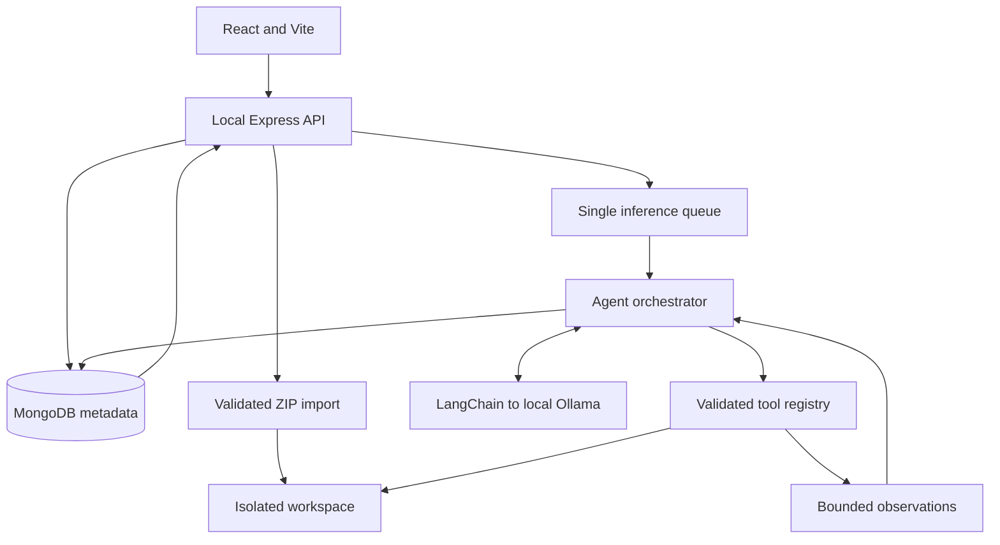

# Architecture diagram

```mermaid
flowchart TD
  UI[React and Vite] --> API[Local Express API]
  API --> DB[(MongoDB metadata)]
  API --> Import[Validated ZIP import]
  Import --> Disk[Isolated workspace]
  API --> Queue[Single inference queue]
  Queue --> Agent[Agent orchestrator]
  Agent <--> LLM[LangChain to local Ollama]
  Agent --> Registry[Validated tool registry]
  Registry --> Disk
  Registry --> Evidence[Bounded observations]
  Evidence --> Agent
  Agent --> DB
  DB --> API
```
